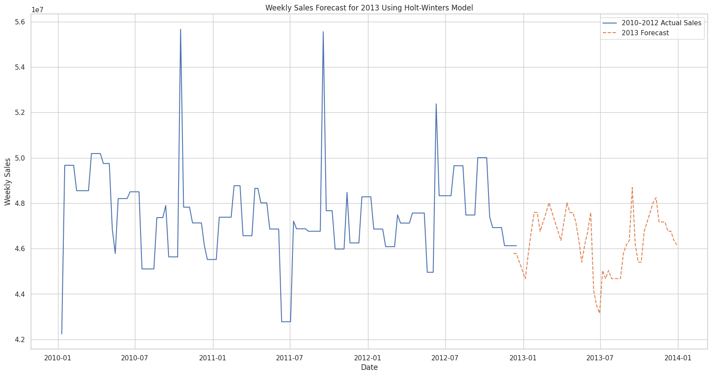

# 🛒 Retail Demand Forecasting & Sales Analysis

This project presents an end-to-end solution for analyzing retail store performance, segmenting departments, discovering product relationships, forecasting demand, and evaluating the effectiveness of marketing campaigns using data from a multi-store, multi-department retail chain (2010–2012).

## 📌 Objective

- Forecast weekly sales at store and department levels  
- Detect sales anomalies  
- Cluster stores and departments  
- Discover product affinity using market basket analysis  
- Incorporate external factors into demand models  
- Evaluate a hypothetical marketing campaign using causal inference  

---

## 🗂️ Dataset

The dataset contains historical sales and associated features across multiple stores and departments.

**Key Columns:**
- `Store`, `Dept`, `Date`, `Weekly_Sales`, `IsHoliday`
- `CPI`, `Temperature`, `Fuel_Price`, `Unemployment`
- `MarkDown1-5`

---

## 🔧 Project Structure
```plaintext  
retail-demand-forecasting/
├── README.md
├── requirements.txt
├── Python Code/
│   └── Integrated_Retail_Analytics_for_Store_Optimization_and_Demand_Forecasting.ipynb
├── Detailed Documentation/
│   └── Integrated_Retail_Analytics_for_Store_Optimization_and_Demand_Forecasting_Detailed_Documentation
├── images/
│   ├── sales_forecast.png
│   └── campaign_impact.png
│   └── Store cluster.png
│   └── Feature Importance.png
└── Dataset/
    └── features.csv
    └── stores.csv
    └── sales.csv

```
---

## 🔍 Exploratory Data Analysis (EDA)

- Handled missing values and converted data types
- Created new features: lagged sales, rolling mean, % change
- Time series decomposition revealed strong seasonality
- Spearman correlation showed strong ±ve relations among CPI, Fuel Price & Unemployment

---

## 📉 Sales Anomaly Detection

Detected sales spikes/drops using:
- Rolling Average + Std Deviation Threshold
- EWMA (Exponentially Weighted Moving Average)

💡 **Insight**: Over 90% of anomalies occurred during non-holiday weeks.

---

## 🧩 Store & Department Segmentation

**Technique**: PCA → K-Means Clustering

- 📊 Clustered stores into 4 profiles based on sales, CPI, and size
- 📦 Department clusters revealed high/low performers for targeted strategy

---

## 🛍️ Market Basket Analysis

**Method**: Apriori Algorithm

- Mined association rules (e.g. Dept 29 → 30, lift = 8.9)
- Strong co-occurrence suggests bundling or store layout optimization

---

## 📈 Forecasting Models

### ▶️ Holt-Winters Model
- Seasonal + trend + Box–Cox + damped trend
- Forecasted 2013 sales based on 2010–2012
- MAE: ~3.25M, RMSE: ~4.25M (after optimization)

### ▶️ SARIMA Model
- SARIMAX with external regressors (CPI %, Fuel %, Temp %)
- Better forecast accuracy with external data integration

### ▶️ Random Forest Regressor
- Feature-rich model with Markdown, lags, % changes
- MAE: ~8.9K, RMSE: ~9.2K (optimized)

---
## 🖼️ Visual Insights
| Visualization                                                | Description                                                   |
| -------------------------------------------------------------| ------------------------------------------------------------- |
|                   | Forecasted sales using Holt-Winters and SARIMAX models        |
|   | Causal impact of a marketing campaign on Dept 4               |
|                  | Clustering of stores using KMeans and PCA                     |
|          | Top features contributing to sales prediction (Random Forest) |


## 📢 Marketing Campaign Analysis

A synthetic campaign was introduced for **Dept 4** (Q3–2012).

### ▶️ Causal Inference (CausalImpact)
- 📈 Average uplift in weekly sales: **+14,573**  
- 📦 Cumulative impact: **+247,735**  
- 🎯 Relative lift: **~30%**, 95% CI = [27%, 33%]  
- ✅ **Posterior probability of causal effect: 100%**

---

## 🧠 Strategic Recommendations

### 🔄 Inventory Management
- Use CPI and temperature to dynamically manage stock
- Anticipate seasonal spikes using forecast models

### 💰 Pricing Strategy
- Adjust prices based on CPI
- Launch discounts during low inflation/fuel price periods

### 📍 Store Optimization
- Reorganize layout based on co-purchase patterns
- Tailor inventory based on store cluster profile

---

## ⚠️ Challenges

- Missing values and frequency issues in time series
- Holt-Winters convergence warnings
- Overfitting risk in RF without proper tuning
- Date mismatch issues in causal inference due to weekly frequency

---

## 💾 Installation

```bash
git clone https://github.com/Souvik-karmakar/retail-demand-forecasting.git
cd retail-demand-forecasting
pip install -r requirements.txt
```

## 🤝 Contact
- For any queries or collaboration, feel free to connect:
- Name: Souvik Karmakar
- Email: ksouvik98@gmail.com
- LinkedIn: [linkedin.com/in/souvik-karmakar](https://www.linkedin.com/in/souvik-karmakar83/)


